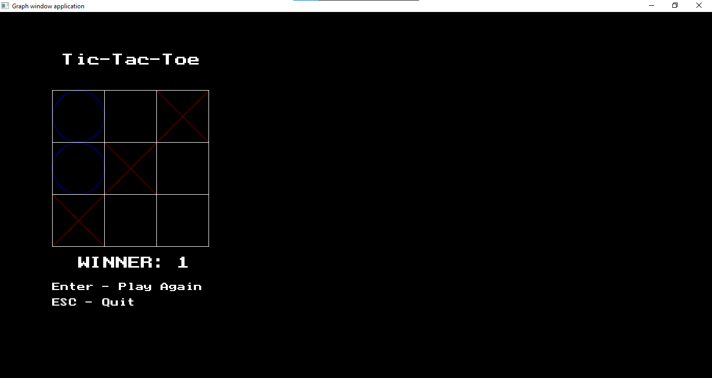

# Tic-Tac-Toe Game

This Pascal program implements a simple console-based Tic-Tac-Toe game. Players take turns marking a 3x3 grid with their respective symbols (X or O) until one player wins by having three of their symbols in a row horizontally, vertically, or diagonally.

## How to Play

1. Run the program in a Pascal-compatible IDE or compiler.

2. The game board is represented by a 3x3 grid.

3. Players take turns making moves by pressing the corresponding number on the numpad:

    - `7`, `8`, `9`: Top row
    - `4`, `5`, `6`: Middle row
    - `1`, `2`, `3`: Bottom row

4. The game ends when:

    - One player wins by having three symbols in a row (horizontally, vertically, or diagonally).
    - The game results in a tie (all cells are filled).

5. After the game ends, the winner or a tie is displayed.

## Screenshots

## Technical Details

-   **Language Used:** Pascal
-   **Dependencies:** WinCRT, Graph unit for graphical interface
-   **Implementation:** The game uses a simple console-based graphical interface for visualizing the Tic-Tac-Toe board.
